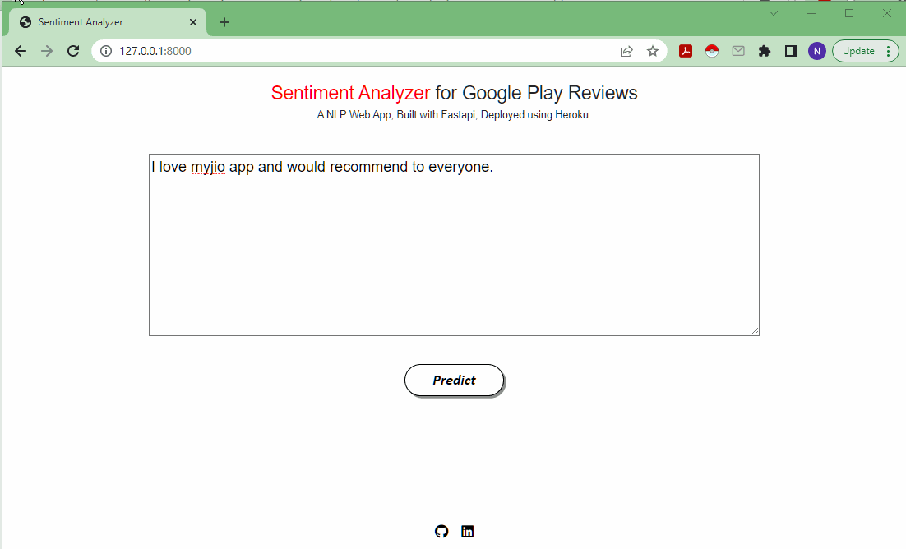

# Sentiment-Analysis-Google-Play-App-Reviews 

#### Sử dụng bộ dữ liệu tiếng Việt

Mục đích của dự án này là tạo ra một tập dữ liệu tùy chỉnh để phân tích tình cảm. Sử dụng dữ liệu để tinh chỉnh mô hình BERT và triển khai mô hình NLP của bạn dưới dạng API.

• Kho lưu trữ này bao gồm các tệp cần thiết để triển khai từ đầu đến cuối Phân tích ý kiến ​​của Ứng dụng web xử lý ngôn ngữ tự nhiên trên Google Play Đánh giá ứng dụng ngôn ngữ tự nhiên được tạo bằng ___FastApi.

## setup
- Clone the repository : https://github.com/ITHealer/Sentiment-Analysis-with-Bert-and-Hugging-Face-using-Torch.git
- Bên trong thư mục gốc của dự án, Tạo Môi trường Ảo Python và kích hoạt nó bằng các lệnh dưới đây
```console
$ python3 -m venv env
``` 

Activate Virtual Environment
```console
$ .env/bin/activate 
          OR
$ .\env\Scripts\activate
```
Install Libraries using below command
```console
$ pip install -r requirements.txt
```

- Chạy sổ ghi chép jupyter để lấy các tệp cần thiết nếu bạn cố gắng tạo nó từ đầu.

## The Files explained
Sử dụng các tệp như sau để tạo dự án từ đầu hoặc tạo dự án của riêng bạn theo cách phù hợp.

**1. scrape_app_information.ipynb** to scrape top 15 app information  from the productivity category using google-play-scraper package.

**2. scrape_app_reviews.ipynb** to scrape more than 15k user reviews from those 15 productivity apps using google-play-scraper package.

**3. sentiment_analysis_with_bert_and_hugging_face_using_torch.ipynb** to fine-tune BERT for sentiment analysis and save the best model for deployment purpose. Here, you'll do the required text preprocessing (special tokens, padding, and attention masks) and build a Sentiment Classifier using Transformers.

**4. sentiment_analyzer/assets/** please put saved model file named best_model_state.bin into this directory.

**5. sentiment_analyzer/classifier/sentiment_classifier.py** to create a classifier that uses the BERT model.

**6. sentiment_analyzer/classifier/model.py** to create an interface to abstract the inference logic. It exposes a single predict() method with all the text processing required to build a sentiment analysis model.

- Bây giờ bên trong thư mục sentiment_analyzer chạy ** api.py ** trên terminal để khởi động máy chủ cục bộ (local server).
```console
$ uvicorn api:app --reload
```

## App Demo



• Để lại ⭐ cho project của tôi nếu nó giúp ích cho bạn.
